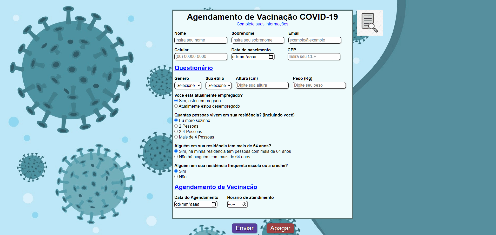

<h1 align="center">

 
  
 
 
Formulário de Vacinação
</h1>

Formulário online para agendamento de vacinação, desenvolvido em HTML, CSS e Javascript.

  

[//]: # (Adicionar os gifs/imagens aqui:)

  

## 🔨 Seja um dos contribuidores 

Quer fazer parte desse projeto? Clique [AQUI](CONTRIBUTING.md) e leia como contribuir.

<a href='#voltar-topo'>⬆ Voltar ao topo</a> 
